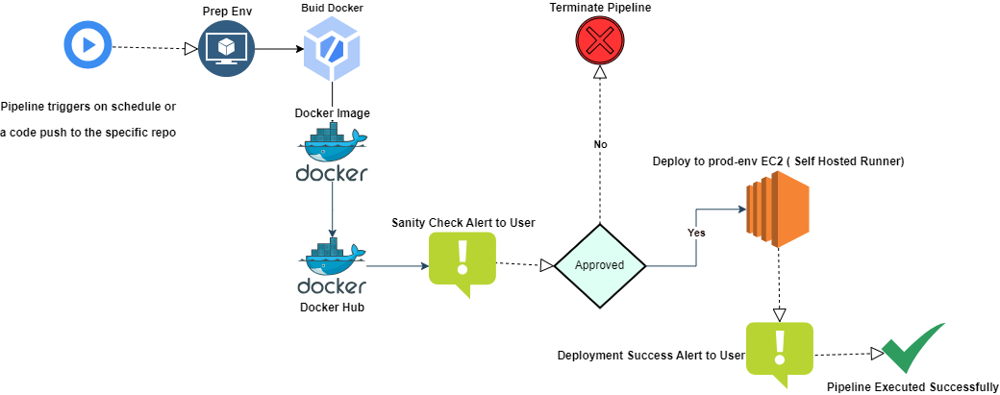
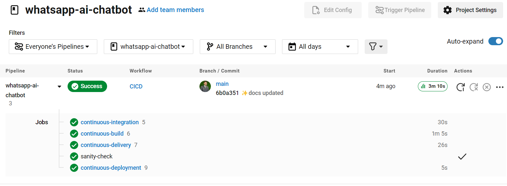

<p align="center">
    <b>
        <h1 align="center">WhatsApp Chatbot</h1>
    </b>
</p>
<p align="center">
<a href="https://github.com/Hassi34/whatsapp-ai-chatbot">
    
</a>
</p>
<p align="center">
  
</p>


<p align="center">
    <a href="https://www.python.org/downloads/">
        
    </a>
    <a href="https://github.com/Hassi34/whatsapp-ai-chatbot">
        
    </a>
    <a href="https://github.com/Hassi34/whatsapp-ai-chatbot">
        
    </a>
    <a href="https://github.com/Hassi34/whatsapp-ai-chatbot">
        
    </a>
    <a href="https://github.com/Hassi34/whatsapp-ai-chatbot">
        
    </a>
    <a href="https://github.com/Hassi34/whatsapp-ai-chatbot/blob/main/LICENSE">
        
    </a>
    <a href="https://github.com/hassi34/whatsapp-ai-chatbot/issues">
        
    </a>
    <a href="https://github.com/hassi34/whatsapp-ai-chatbot/issues">
        
    </a>
</p>

Following are the main contents to follow, you can jump to any section:

>   -  [Introduction](#project-intro)<br>
>   -  [System Design](#system-design)<br>
>   -  [Key Features](#key-features)<br>
>   -  [Tech Stack](#tech-stack)<br>
>   -  [Infrastructure](#infra-)<br>
>   -  [Run Locally](#run-locally)<br>
>      - [Run with source code](#run-source)<br>
>      - [Run a docker container](#run-container)<br>
>        - [Pull Image from Docker Hub](#docker-container)<br>
>        - [Docker Container](#docker-container)<br>
>      - [Environment Variables](#env-vars)<br>
>   -  [Conclusion](#conclusion-)<br>

### Introduction<a id='project-intro'></a>  
WhatsApp Chatbot with OpenAI Integration is a sophisticated messaging bot that can be deployed to interact with users on WhatsApp. Leveraging the Twilio API for WhatsApp messaging and the LangChain by OpenAI for natural language processing, this bot can understand and respond to user queries in a conversational manner. It goes beyond basic chatbots by utilizing custom tools to access the internet, ensuring that it can provide up-to-date information and perform a wide range of tasks.
## System Design<a id='system-design'></a>  

## Key Features<a id='key-features'></a> 
 
1- **Seamless WhatsApp Integration:** Users can interact with the chatbot just like they would with any other contact on WhatsApp, making it a user-friendly and familiar experience.

2- **Natural Language Processing:** The chatbot uses OpenAI's advanced language models to understand and generate human-like responses, making interactions feel more natural and engaging.

3- **Custom Tools:** Custom-built tools enhance the bot's capabilities, allowing it to access the internet for real-time information retrieval and perform a variety of tasks.

4- **Internet Access**: The bot can browse the internet to fetch the latest information, news, weather updates, and more, ensuring users receive up-to-date answers.

5- **Customizable:** Developers can easily customize the bot's responses, actions, and integration with other services to meet specific project requirements.

6- **DevOps Practices:** This project adheres to industry-standard DevOps practices for deployment, ensuring reliability, scalability, and ease of maintenance.

## Tech Stack Used<a id='tech-stack'></a>
<pre>
1. Python 
2. Generative AI 
3. Docker
4. RESTful API(Flask)
5. Chatbot
6. Cloud Computing
7. SMTP Server
</pre>
## Infrastructure<a id='infra-'></a>
<pre>
1. DockerHub
2. Twilio
3. ChatGPT
4. GitHub
5. Ngrok
6. CircleCI
7. AWS-EC2 as a Self hosted runner
</pre>
## CICD on Circleci


## Run Locally<a id='run-locally'></a>
Either you can clone the repo and run the project using source or you can directly run a docker container
#### Run with source code<a id='run-source'></a>
* Ensure you have [Python 3.8+](https://www.python.org/downloads/) installed.

* Create a new Python Conda environment:<a id='env-setup'></a>

```bash
conda create -n venv python=3.11  
conda activate venv 
```
OR
* Create a new Python virtual environment with pip:
```bash
virtualenv venv
source venv/Scripts/activate
```
Install dependencies

```bash
  pip install -r requirements.txt
```

Clone the project

```bash
  git clone https://github.com/Hassi34/whatsapp-ai-chatbot.git
```

Go to the project directory

```bash
  cd whatsapp-ai-chatbot
```

#### Export the environment variable<a id='env-vars'></a>
```bash
OPENAI_API_KEY=""
SERPAPI_API_KEY=""
OPENWEATHER_API_KEY=""

AWS_ACCESS_KEY_ID=""
AWS_SECRET_ACCESS_KEY=""
AWS_DEFAULT_REGION=""

ENV_FILE_PATH_RUNNER=""

#Email Alerts
EMAIL_PASS=""
SERVER_EMAIL=""
SANITY_CHECK_EMAIL_RECIPIENTS=""
PRODUCTION_DEPLOYMENT_SUCCESS_EMAIL_RECIPIENTS=""

```

#### Run a docker container<a id='run-container'></a>
First ensure you have the docker installed on your system and then run following commands: 👇🏻

#### Pull Image from Docker Hub<a id='docker-pull'></a>
In case you have not already pulled the image from the Docker Hub, you can use the following command:
```bash
docker pull hassi34/whatsapp-ai-chatbot
```

#### Docker Container<a id='docker-container'></a>
Now once you have the docker image from the Docker Hub, you can now run the following commands to test and deploy the container to the web

* Run a Docker Container<a id='run-docker-container'></a><br>
Check all the available images:
```bash
docker images
```
Use the following command to run a docker container on your system:
```bash
docker run -itd -e OPENAI_API_KEY=$OPENAI_API_KEY -e SERPAPI_API_KEY=$SERPAPI_API_KEY -e OPENWEATHER_API_KEY=$OPENWEATHER_API_KEY -e AWS_ACCESS_KEY_ID=$AWS_ACCESS_KEY_ID -e AWS_SECRET_ACCESS_KEY=$AWS_SECRET_ACCESS_KEY -e AWS_DEFAULT_REGION=$AWS_DEFAULT_REGION --name <CONTAINER NAME> -p 8080:8080 hassi34/whatsapp-ai-chatbot
```
Check if the container is running:
```bash
docker ps -a
```
If the container is running, then the API services will be available at port 8080<br>
Enter the following url to you Twilio Post request:<br>
```bash
http://<YOUR IP ADDRESS>:8080/chatgpt_webhook
```

## Conclusion<a id='conclusion-'></a>
This project is production ready for similar use cases and comes with the industry standard engineering practices.
#### **👉🏻Thank you for visiting 🙏 Your feedback would be highly appreciated 💯😊**<br>
#### **👉🏻If you find this project useful then don't forget to star the repo ✨⭐🤖**<br>
#### 🌏[My Portfolio Website][website] <br><br>
#### **📃 License**
[MIT][license] © [Hasanain][website]

[license]: hhttps://github.com/Hassi34/brain-tumor-classification/blob/main/LICENSE
[website]: https://hasanain.aicaliber.com

Let's connect on **[``LinkedIn``](https://www.linkedin.com/in/hasanain-mehmood)** <br>